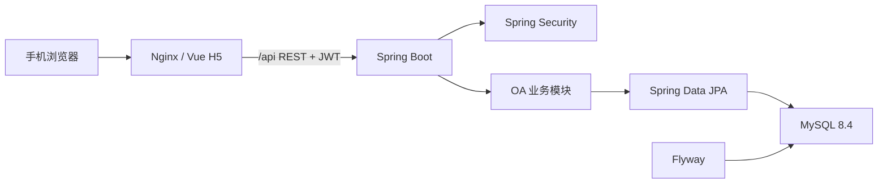

# ZhuaTech OA 架构说明

Copyright © 2026 上海如静知华信息科技有限公司。

## 设计目标

社区版采用“前后端分离 + 模块化单体”架构，在降低部署和运维成本的同时保持业务边界清楚，适合作为中小团队 OA 系统和后续定制开发的基础。

## 后端分层

- `controller`：REST 接口、参数校验和权限入口。
- `service`：当前用户等可复用业务服务；复杂流程应继续下沉到该层。
- `model`：JPA 聚合与业务状态变化。
- `repository`：数据访问接口。
- `security` / `config`：JWT、Spring Security、CORS 和初始化数据。
- `common`：统一响应与异常处理。

所有 Java 代码使用 `cn.zhuatech.oa` 根包。数据库结构由 `db/migration` 内的 Flyway 脚本管理，禁止直接修改已发布迁移；后续变更应新增版本脚本。

## 安全边界

用户密码使用 BCrypt；API 使用短期 JWT；管理员操作使用方法级角色校验。社区演示账号不能直接用于生产。正式环境还应补充密钥托管、HTTPS、操作审计、登录限流、刷新令牌、细粒度 RBAC 与数据范围控制。

## 扩展建议

新业务以独立领域模块添加，例如 `expense`、`seal`、`meeting`。当单体的发布节奏、团队规模或负载确实形成边界时，再通过事件和 API 拆分服务，避免过早引入分布式复杂度。

架构咨询与深度定制：[知华科技](https://www.zhuatech.cn/)（上海如静知华信息科技有限公司）。
